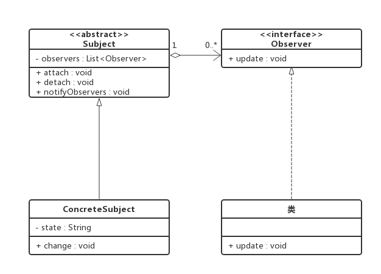
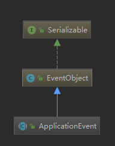

## Spring 启动源码（一）
### 1. 观察者模式——事件机制的底层原理
所涉及到的角色如下：
* 抽象主题（Subject）：提供接口，可以增加和剔除观察者对象。一般用抽象类或者接口实现。
* 抽象观察者（Observer）：提供接口，在得到主题的通知时更新自己。一般用抽象类或者接口实现。
* 具体主题（ConcreteSubject）：将有关状态存入具体观察者，在具体主题的内部状态发生变化时，给所有注册过的观察者发出通知。一般是具体子类实现。
* 具体观察者（ConcreteObserver）：存储与主题的状态自恰的状态。具体观察者角色实现抽象观察者角色所要求的更新接口，以便使本身的状态与主题的状态 像协调。如果需要，具体观察者角色可以保持一个指向具体主题对象的引用
设计模式关系图：
### 2. JDK实现，java.util包下，提供了一个Observable类以及一个Observer接口，构成Java语言对观察者模式的支持。
Observable抽象主题用普通类实现，Observer 抽象观察者，接口实现
### 3. JDK中的事件
JDK 1.0及更早版本的事件模型基于职责链模式，但是这种模型不适用于复杂的系统，因此在JDK 1.1及以后的各个版本中，事件处理模型采用基于观察者模式的委派事件模型(DelegationEvent Model, DEM)，即一个Java组件所引发的事件并不由引发事件的对象自己来负责处理，而是委派给独立的事件处理对象负责。这并不是说事件模型是基于Observer和Observable的，事件模型与Observer和Observable没有任何关系，Observer和Observable只是观察者模式的一种实现而已。
java中的事件机制的参与者有3种角色
* Event Source：事件源，发起事件的主体。
* Event Object：事件状态对象，传递的信息载体，就好比Watcher的update方法的参数，可以是事件源本身，一般作为参数存在于listerner 的方法之中。
* Event Listener：事件监听器，当它监听到event object产生的时候，它就调用相应的方法，进行处理。
* 其实还有个东西比较重要：事件环境，在这个环境中，可以添加事件监听器，可以产生事件，可以触发事件监听器。
* 限于篇幅，具体案例实现就不讲了，大家可以去spring-boot-test获取，在com.lee.jdkevent下，里面注释写的很详细了，大家可以好好看看。
### 4.Spring的事件机制
spring的事件机制也是从java的事件机制拓展而来。
* ApplicationEvent：Spring中所有的事件父接口，继承自java的EventObject

ApplicationListener：spring中所有的事件监听器父接口，继承自java的EventListener
```
package org.springframework.context;
 import java.util.EventListener;
 //类似jdk里的Observer
 public interface ApplicationListener<E extends ApplicationEvent> extends EventListener {
 	//类似jdk Observer中的update方法。
 	void onApplicationEvent(E event);
 }
 ```
 ### 5.总结
  #### 5.1观察者模式的优缺点：
 ######优点：
1. 主题与观察者建立一个抽象的耦合而不是紧密的耦合，降低了耦合度；主题只需要维护一个抽象观察者的集合，无需了解具体观察者，使得可以有各种各样不同的观察者实现。
2. 支持广播通信，主题会向所有已注册的观察者对象发送通知，简化了一对多系统设计的难度。
3. 符合“开闭原则”，增加新的具体观察者无须修改原有代码，可拓展性高。
###### 缺点：
1. 如果主题有很多直接或者间接观察者，那么全部通知到会很耗时。
2. 主题与观察者之间如果存在循环依赖，可能导致系统崩溃。
 #### 5.2事件机制
jdk事件实现是基于观察者模式，而spring事件又是在jdk事件的基础上进行了拓展。主要有四个角色：
* 事件源：触发事件的主体，比如jdk事件案例中的UserService、spring事件案例中的MessageService、SpringBoot中的SpringApplication。
* 事件：事件本身，指的是EventObject中的source，具体可以是任何数据（包括事件源），用来传递数据，比如jdk事件案例中MessageEvent、spring事件案例中的MessageEvent。
* 事件监听器：当事件发生时，负责对事件的处理，比如jdk事件案例中MessageListener、spring事件案例中的MessageListener。
* 事件环境：整个事件所处的上下文，对整个事件提供支持，类似web上下文；比如jdk事件案例中的UserService、spring事件案例中的ApplicationContext


