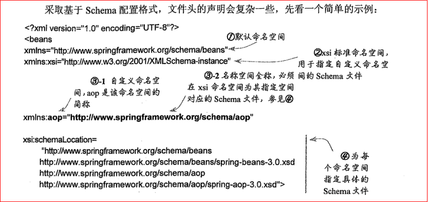
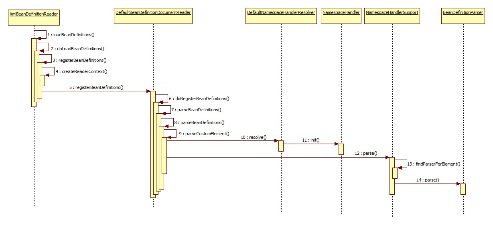

## Spring自定义标签和spring.handlers的加载过程
文章来源：[Spring自定义标签和spring.handlers的加载过程](https://blog.csdn.net/wabiaozia/article/details/78631259)
###1. schema配置 
* XML 文件中的配置

```xml
<?xml version="1.0" encoding="UTF-8"?>
<beans xmlns="http://www.springframework.org/schema/beans"
		xmlns:xsi="http://www.w3.org/2001/XMLSchema-instance"
		xmlns:aop="http://www.springframework.org/schema/aop"
		xsi:schemaLocation="http://www.springframework.org/schema/beans http://www.springframework.org/schema/beans/spring-beans-2.0.xsd
				http://www.springframework.org/schema/aop http://www.springframework.org/schema/aop/spring-aop-2.0.xsd">
```
+ Spring自定义标签的原理：
  - XML通常通过DTD、XSD定义，但DTD的表达能力较弱，XSD定义则能力比较强，能够定义类型，出现次数等。自定义标签需要XSD支持，在实现时使用Namespace扩展来支持自定义标签。
  - Spring通过XML解析程序将其解析为DOM树，通过NamespaceHandler指定对应的Namespace的BeanDefinitionParser将其转换成BeanDefinition。再通过Spring自身的功能对BeanDefinition实例化对象。
* 在期间，Spring还会加载两项资料：
  - META-INF/spring.handlers：
  指定NamespaceHandler(实现org.springframework.beans.factory.xml.NamespaceHandler)接口，或使用org.springframework.beans.factory.xml.NamespaceHandlerSupport的子类。
  - META-INF/spring.schemas：将命名空间重定向到本地，避免从网络下载，this.namespaceHandlerResolver == null验证你自定义的xml配置文件是否符合你的格式要求；
在解析XML文件时将XSD重定向到本地文件，避免在解析XML文件时需要上网下载XSD文件。通过现实org.xml.sax.EntityResolver接口来实现该功能。
* 制作自定义的标签

###2. 自定义标签和handler的加载过程 
引入一个命名空间后就可以使用该命名空间对应的schema文件中定义的节点，命名空间对应的XSD文档在spring.schemas文档中定义，
命名空间对应的处理器在spring.handlers中定义，处理器的init方法中会根据element的名字找到对应的BeanDefinitionParser
###3. spring启动容器到handlers加载过程中间每一步怎么走的
1. 在步骤4createReaderContext的时候，会做如下检查，如果没有resolver会创建一个默认的DefaultNamespaceHandlerResolver
```
if (this.namespaceHandlerResolver == null) {
            this.namespaceHandlerResolver = createDefaultNamespaceHandlerResolver();
        }
```
Spring.handlers这个文件名和路径就定义在这个类中。定义如下：
```
public static final String DEFAULT_HANDLER_MAPPINGS_LOCATION = "META-INF/spring.handlers";
```
2. 在步骤10中根据会根据传入的namespaceUri找到对应的NamespaceHandler，这个映射是在spring.handlers中配置的。
3. 在步骤13中会根据element的名字找到对应的BeanDefinitionParser，这个是在NamespaceHandler的init()方法里面来配置的。


